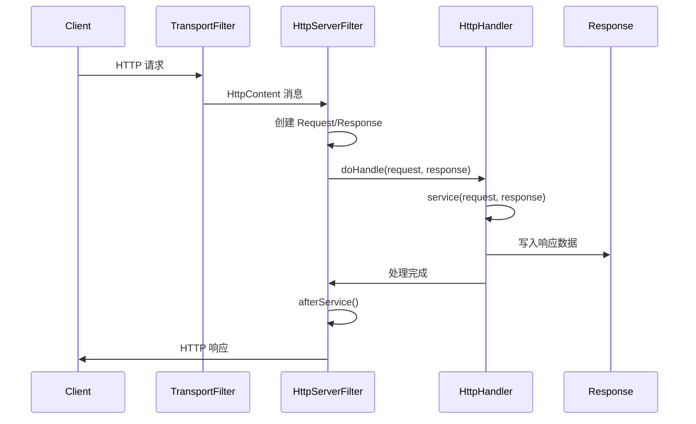

# HTTP 请求处理架构

## 概述

Grizzly HTTP Server 的请求处理是一个基于 **Filter Chain（过滤器链）** 模型的高性能异步处理框架。核心设计目标是通过 NIO（非阻塞 I/O）实现高并发、低延迟的 HTTP 请求处理。

请求处理流程涉及多个核心组件：
- **HttpServerFilter**: HTTP 服务器的核心过滤器，负责请求/响应的协调处理
- **Request**: HTTP 请求的高级封装
- **Response**: HTTP 响应的高级封装
- **HttpHandler**: 用户请求处理逻辑的抽象基类
- **HttpHandlerChain**: 多个 HttpHandler 的链式调度器

## 模块结构

```
modules/http-server/
├── src/main/java/org/glassfish/grizzly/http/server/
│   ├── HttpServerFilter.java       # 核心请求处理过滤器
│   ├── HttpHandler.java             # 请求处理器基类
│   ├── HttpHandlerChain.java        # 处理器链
│   ├── Request.java                 # 请求对象封装
│   ├── Response.java                # 响应对象封装
│   ├── HttpServer.java              # HTTP 服务器主类
│   ├── NetworkListener.java         # 网络监听器
│   ├── ServerConfiguration.java     # 服务器配置
│   ├── io/                          # I/O 缓冲区实现
│   │   ├── ServerInputBuffer.java   # 服务器输入缓冲区
│   │   └── ServerOutputBuffer.java  # 服务器输出缓冲区
│   ├── filecache/                   # 文件缓存优化
│   └── util/                        # 工具类（Mapper, DispatcherHelper 等）
```

## 核心组件

### 1. HttpServerFilter

**位置**: `modules/http-server/src/main/java/org/glassfish/grizzly/http/server/HttpServerFilter.java:62`

这是整个 HTTP 请求处理的核心入口，作为 Grizzly Filter Chain 中的一个关键过滤器存在。

#### 主要职责
- 接收来自 HTTP 层的 `HttpContent` 消息
- 创建和管理 `Request`/`Response` 对象
- 将请求分发到 `HttpHandler` 进行处理
- 管理请求生命周期和资源回收
- 处理请求挂起（Suspend）/恢复（Resume）机制

#### 关键字段
```java
// 存储当前正在处理的请求
private final Attribute<Request> httpRequestInProgress;

// 控制挂起请求的超时队列
private final DelayedExecutor.DelayQueue<Response.SuspendTimeout> suspendedResponseQueue;

// 根 HTTP 处理器
private volatile HttpHandler httpHandler;

// 服务器配置
private final ServerFilterConfiguration config;

// 当前活动请求计数器（用于优雅关闭）
private final AtomicInteger activeRequestsCounter;
```

#### 核心处理方法: handleRead()

**位置**: `HttpServerFilter.java:142`

```java
@Override
public NextAction handleRead(final FilterChainContext ctx) throws IOException {
    final Object message = ctx.getMessage();

    if (HttpPacket.isHttp(message)) {
        final HttpContent httpContent = (HttpContent) message;
        Request handlerRequest = httpRequestInProgress.get(context);

        if (handlerRequest == null) {
            // 新 HTTP 请求
            handlerRequest = Request.create();
            handlerRequest.initialize(request, ctx, this);
            handlerResponse.initialize(handlerRequest, response, ctx, ...);

            // 调用 HttpHandler 处理
            wasSuspended = !httpHandlerLocal.doHandle(handlerRequest, handlerResponse);

            if (!wasSuspended) {
                return afterService(ctx, connection, handlerRequest, handlerResponse);
            }
        } else {
            // 处理挂起的请求（继续接收数据）
            handlerRequest.getInputBuffer().append(httpContent);
        }
    }
}
```

### 2. Request

**位置**: `modules/http-server/src/main/java/org/glassfish/grizzly/http/server/Request.java:84`

高级 HTTP 请求对象，封装了底层 `HttpRequestPacket`。

#### 核心功能
- 请求参数解析（URL 参数和 POST 表单）
- Cookie 解析
- Session 管理
- 请求路径解析（ContextPath, ServletPath, PathInfo）
- 非阻塞 I/O 支持（NIOInputStream, NIOReader）

#### 对象池化
Request 使用 ThreadCache 进行对象池化：
```java
private static final ThreadCache.CachedTypeIndex<Request> CACHE_IDX =
    ThreadCache.obtainIndex(Request.class, 16);

public static Request create() {
    final Request request = ThreadCache.takeFromCache(CACHE_IDX);
    if (request != null) {
        return request;
    }
    return new Request(new Response());
}
```

#### 延迟解析
多个解析操作采用延迟执行策略：
- `parseCookies()`: Cookie 延迟解析
- `parseRequestParameters()`: 请求参数延迟解析
- `parseSessionId()`: Session ID 延迟解析
- `parseLocales()`: 语言偏好延迟解析

### 3. Response

**位置**: `modules/http-server/src/main/java/org/glassfish/grizzly/http/server/Response.java:80`

高级 HTTP 响应对象。

#### 挂起状态机
```java
enum SuspendState {
    NONE,       // 正常状态
    SUSPENDED,  // 已挂起（等待异步处理）
    RESUMING,   // 恢复中
    RESUMED,    // 已恢复
    CANCELLING, // 取消中
    CANCELLED   // 已取消
}
```

#### 核心功能
- 响应状态和头部管理
- 输出流和写入器管理
- 挂起/恢复机制（用于异步处理）
- Trailer Headers 支持（HTTP/1.1 chunked 和 HTTP/2）

### 4. HttpHandler

**位置**: `modules/http-server/src/main/java/org/glassfish/grizzly/http/server/HttpHandler.java:51`

用户业务逻辑的抽象基类。

#### 核心方法
```java
public abstract void service(Request request, Response response) throws Exception;
```

#### doHandle() 处理流程
**位置**: `HttpHandler.java:119`

```
1. 配置请求执行器和 Session 管理器
2. 处理 100-Continue 确认（如果需要）
3. 解码 URL（如果配置）
4. 解析 Session ID
5. 调用 service() 方法（可能在单独线程执行）
```

### 5. HttpHandlerChain

**位置**: `modules/http-server/src/main/java/org/glassfish/grizzly/http/server/HttpHandlerChain.java:49`

多个 HttpHandler 的链式调度器，使用 **Mapper** 组件进行请求映射。

#### URL 映射配置
```java
// 添加处理器及其映射
chain.addHandler(httpHandler, new String[] { "/api/*" });
```

#### Mapper 映射
- `contextPath`: 上下文路径
- `urlPattern`: URL 模式（如 `/api/*`, `*.json`）
- 支持精确匹配、前缀匹配、扩展名匹配

## 关键工作流

### 1. 完整请求处理流程



### 2. 请求处理详细流程

**位置**: `HttpServerFilter.java:142-293`

```java
// 步骤 1: 检查是否为新请求
if (handlerRequest == null) {
    // 步骤 2: 创建并初始化 Request/Response
    handlerRequest = Request.create();
    handlerRequest.initialize(request, ctx, this);
    handlerResponse.initialize(handlerRequest, response, ctx, ...);

    // 步骤 3: 请求前处理（大小限制、TRACE 方法检查等）
    if (shuttingDown.get()) {
        // 返回 503 服务不可用
    } else if (isTraceRequest && !isPassTraceRequest) {
        onTraceRequest(handlerRequest, handlerResponse);
    } else if (checkMaxPostSize()) {
        // 返回 413 请求实体过大
    }

    // 步骤 4: 调用 HttpHandler 处理
    wasSuspended = !httpHandler.doHandle(handlerRequest, handlerResponse);

    // 步骤 5: 后处理
    if (!wasSuspended) {
        return afterService(ctx, connection, handlerRequest, handlerResponse);
    } else {
        return ctx.getSuspendAction();
    }
} else {
    // 处理挂起请求的后续数据
    handlerRequest.getInputBuffer().append(httpContent);
}
```

### 3. 异步请求处理（挂起/恢复）

**位置**: `Response.java:1686-1803`

```java
// 挂起响应
public void suspend(long timeout, TimeUnit unit, CompletionHandler<Response> handler) {
    suspendState = SuspendState.SUSPENDED;
    suspendStatus.suspend();
    suspendedContext.init(completionHandler, timeoutHandler);

    if (timeout > 0) {
        delayQueue.add(suspendedContext.suspendTimeout, timeoutMillis, unit);
    }
}

// 恢复响应
public void resume() {
    suspendedContext.markResumed();
    ctx.resume();
}
```

### 4. 请求分发流程

**位置**: `HttpHandlerChain.java:157-205`

```
1. 检查是否为单根处理器（性能优化）
2. 解码请求 URI
3. 使用 Mapper.mapUriWithSemicolon() 进行映射
4. 获取 MappingData（包含 context 和 wrapper）
5. 更新 Request 的路径信息
6. 调用目标 HttpHandler.doHandle()
```

### 5. 请求参数解析

**位置**: `Request.java:1847-1923`

```java
protected void parseRequestParameters() {
    // 1. 设置字符编码
    Charset charset = lookupCharset(getCharacterEncoding());
    parameters.setEncoding(charset);

    // 2. 处理查询字符串参数
    parameters.handleQueryParameters();

    // 3. 如果是 POST 请求且 content-type 为 form
    if (Method.POST.equals(getMethod()) && checkPostContentType(getContentType())) {
        // 4. 检查 POST 大小限制
        if (len > maxFormPostSize) {
            throw new IllegalStateException("POST too large");
        }

        // 5. 读取 POST 数据
        Buffer formData = getPostBody(len);
        parameters.processParameters(formData, ...);
    }
}
```

## 依赖关系

```
HttpServerFilter
    ├── HttpHandler (用户扩展点)
    │   └── HttpHandlerChain (多处理器管理)
    │       └── Mapper (URL 映射)
    ├── Request
    │   ├── HttpRequestPacket (底层 HTTP 请求)
    │   ├── ServerInputBuffer (输入缓冲区)
    │   ├── Parameters (参数解析)
    │   └── Session (会话管理)
    └── Response
        ├── HttpResponsePacket (底层 HTTP 响应)
        ├── ServerOutputBuffer (输出缓冲区)
        └── DelayedExecutor (超时管理)
```

## 集成点

### 1. 与底层 HTTP 模块集成
- `HttpRequestPacket` / `HttpResponsePacket`: 底层 HTTP 协议表示
- `HttpContent`: HTTP 内容消息

### 2. 与 Core NIO 框架集成
- `FilterChainContext`: 过滤器链上下文
- `Connection`: NIO 连接对象
- `TransportFilter`: 传输层过滤器

### 3. 与 HTTP Servlet 模块集成
- `HttpHandler` 类似于 Servlet
- `Request`/`Response` API 与 Servlet API 兼容

## 代码示例

### 基本 HTTP 服务器

```java
HttpServer server = new HttpServer();
NetworkListener listener = new NetworkListener("grizzly", "localhost", 8080);
server.addListener(listener);

ServerConfiguration config = server.getServerConfiguration();
// 添加根处理器
config.addHttpHandler(new HttpHandler() {
    @Override
    public void service(Request request, Response response) throws Exception {
        response.setContentType("text/plain");
        response.getWriter().write("Hello Grizzly!");
    }
}, "/");

server.start();
System.in.read();
server.shutdownNow();
```

### 异步处理示例

```java
public class AsyncHandler extends HttpHandler {
    @Override
    public void service(Request request, Response response) throws Exception {
        // 挂起响应
        response.suspend(30, TimeUnit.SECONDS, new CompletionHandler<Response>() {
            @Override
            public void completed(Response result) {
                // 异步处理完成后恢复
                try {
                    response.setContentType("text/plain");
                    response.getWriter().write("Async result");
                    response.resume();
                } catch (IOException e) {
                    result.setError();
                }
            }

            @Override
            public void cancelled() {
                // 超时处理
            }
        });

        // 在其他线程执行异步操作
        executorService.submit(() -> {
            // 执行耗时操作...
        });
    }
}
```

### 多处理器映射

```java
HttpHandlerChain chain = new HttpHandlerChain(server);

// API 处理器
chain.addHandler(new ApiHandler(), new String[] { "/api/*" });

// 静态资源处理器
chain.addHandler(new StaticHttpHandler("/var/www"), new String[] { "/*" });

// 文件扩展名映射
chain.addHandler(new JsonHandler(), new String[] { "*.json" });
```

## 性能优化

### 1. 对象池化
- Request/Response 使用 ThreadCache 进行对象池化
- 减少垃圾回收压力

### 2. 延迟解析
- Cookie、参数、Session ID 按需解析
- 避免不必要的解析开销

### 3. 零拷贝
- 直接使用底层 Buffer
- CompositeBuffer 支持缓冲区链式组合

### 4. 文件缓存
- `FileCache` 组件缓存静态文件内容
- 支持-sendfile（零拷贝文件传输）

### 5. 非阻塞 I/O
- NIOInputStream/NIOOutputStream 支持异步读写
- ReadHandler/WriteHandler 回调机制

## 参考资料

- **HttpServerFilter.java:142** - handleRead() 核心处理逻辑
- **Request.java:380** - initialize() 初始化方法
- **Response.java:1728** - suspend() 挂起方法
- **HttpHandler.java:119** - doHandle() 处理入口
- **HttpHandlerChain.java:157** - 链式请求分发
