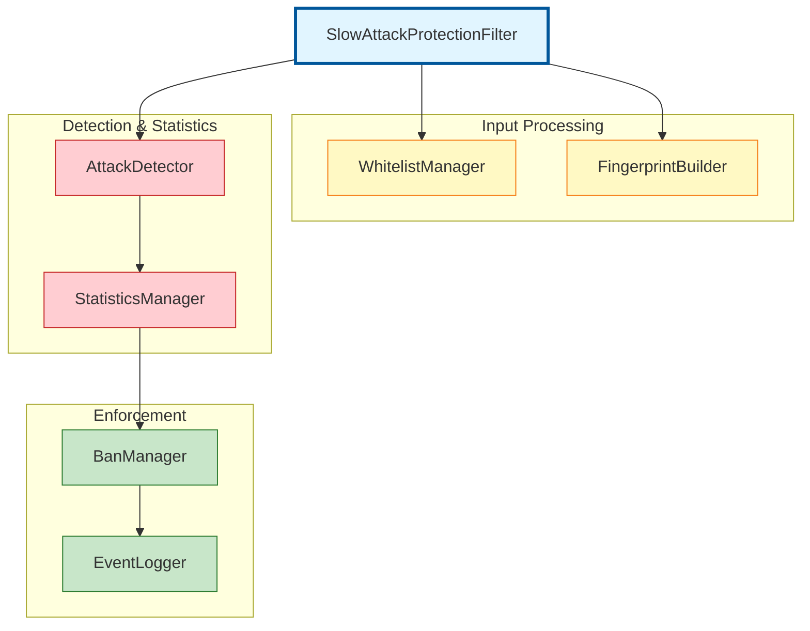
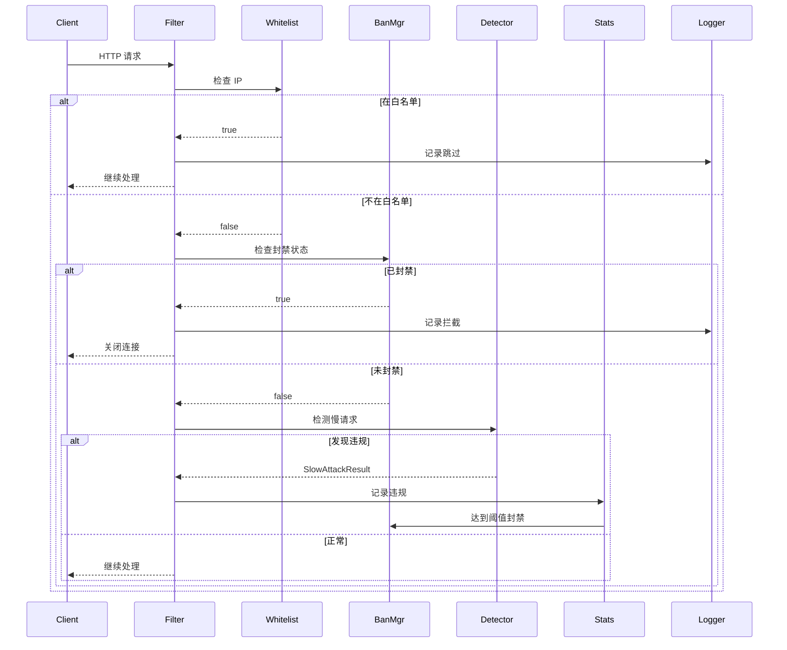
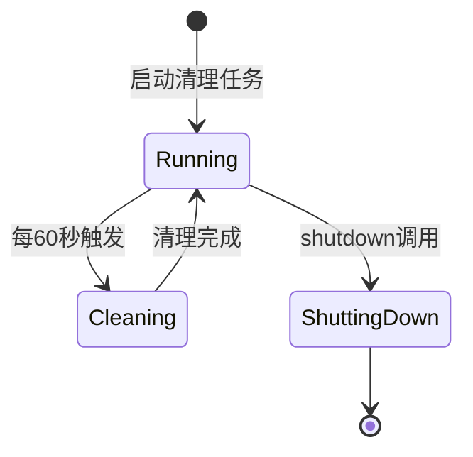
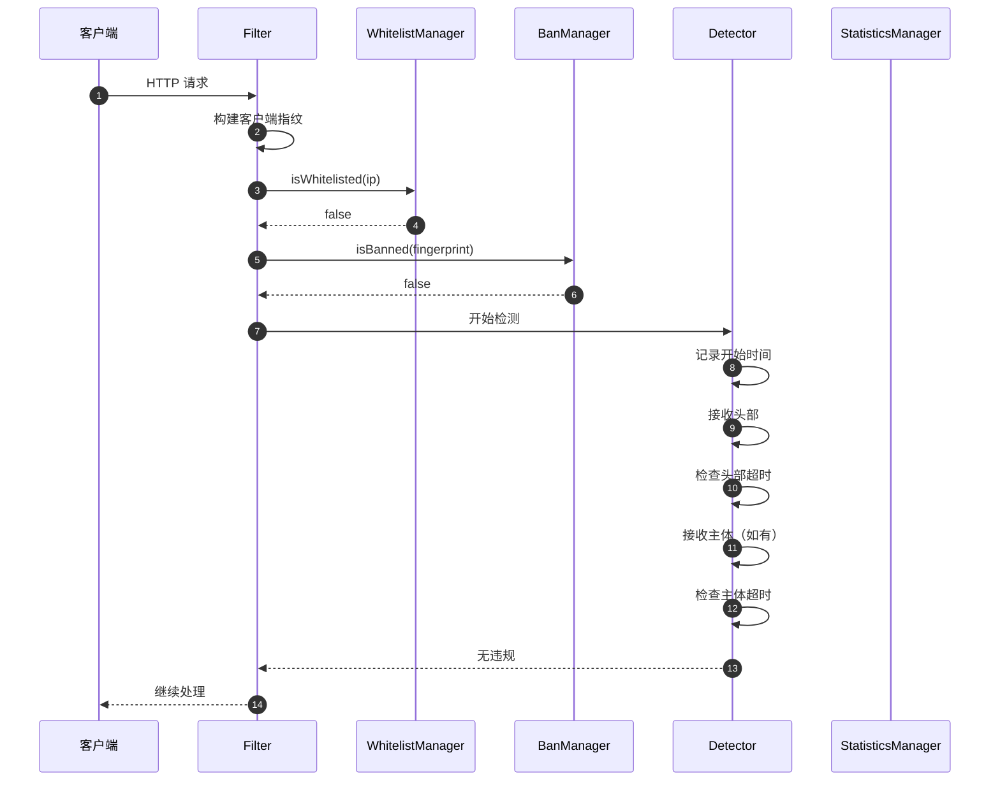
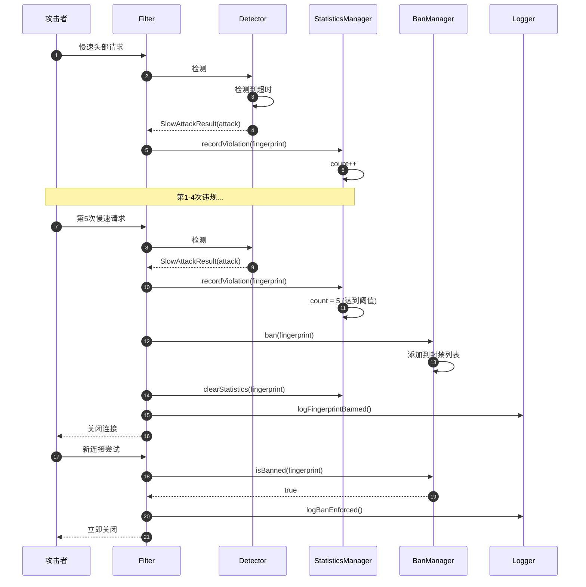
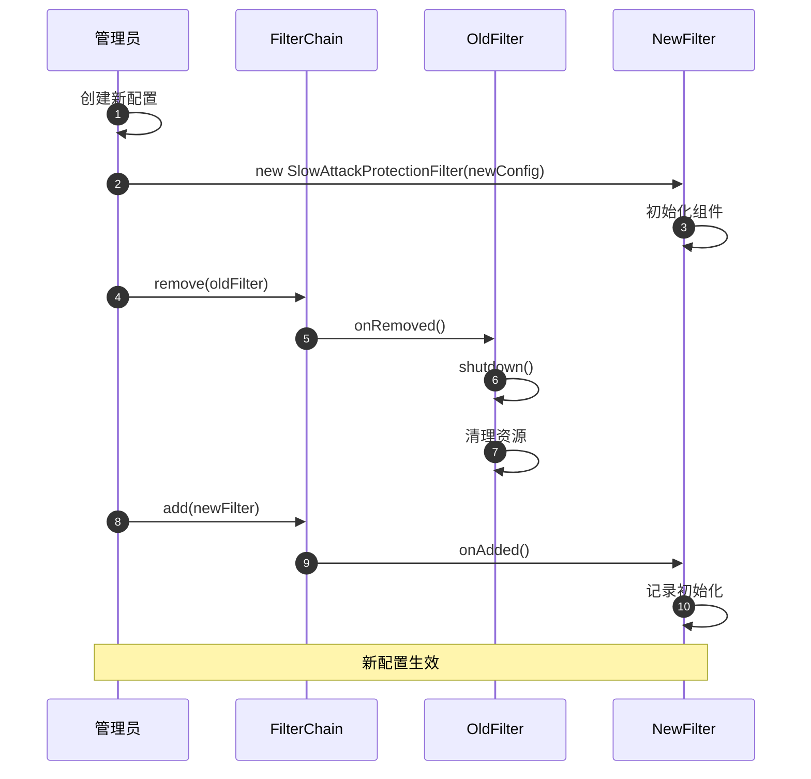
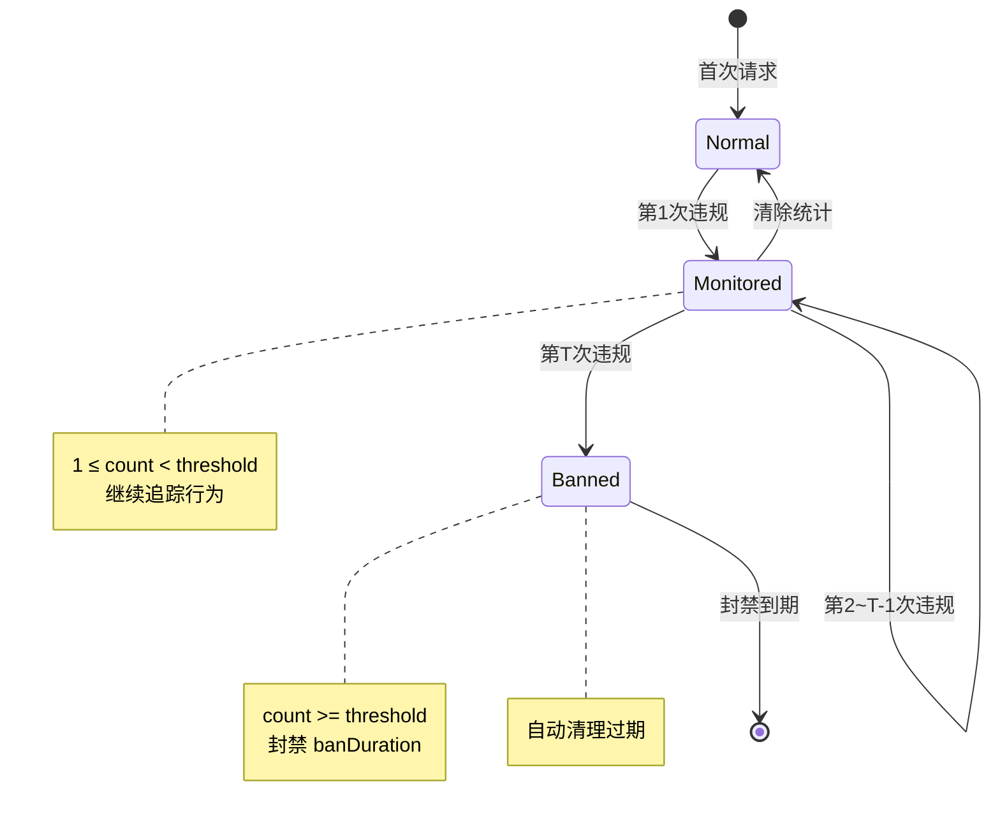
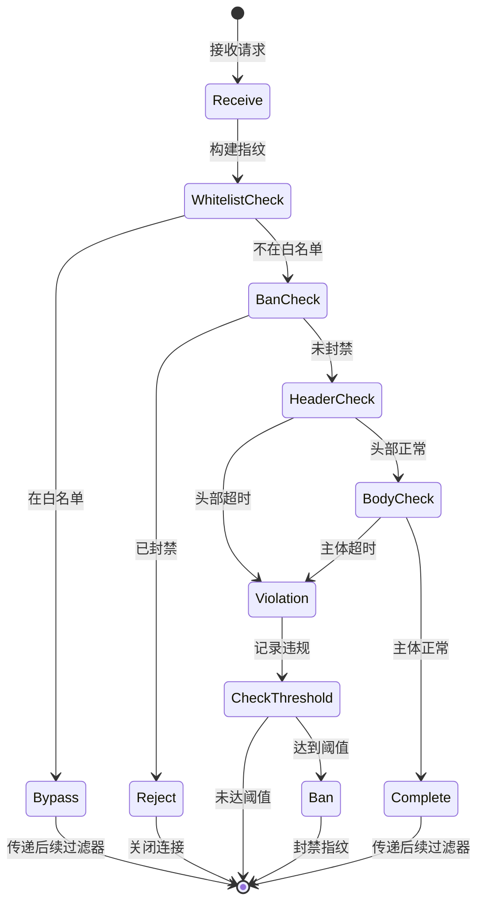
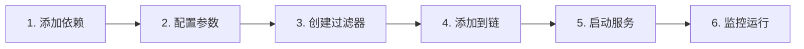

# 慢请求攻击防护功能 - 设计文档

| 文档版本 | 1.0 |
|---------|-----|
| 创建日期 | 2026-03-03 |
| 适用版本 | Grizzly 2.4.x |
| 关联文档 | requirements.md, usecases.md |

---

## 1. 文档概述

### 1.1 文档目的

本文档详细描述 GlassFish Grizzly 慢请求攻击防护功能的设计方案，包括系统架构、组件设计、接口定义、数据结构、时序交互等关键技术细节，为开发实施提供完整的技术指导。

### 1.2 设计目标

| 目标 | 描述 | 优先级 |
|-----|------|-------|
| 高性能 | 对正常请求的性能影响 < 5% | P0 |
| 可扩展 | 支持自定义检测规则和配置 | P1 |
| 易用性 | 提供简洁的 API 和配置方式 | P0 |
| 可靠性 | 组件异常不影响核心功能 | P0 |
| 可观测性 | 提供完整的日志和监控指标 | P1 |

### 1.3 设计原则

- **单一职责**：每个组件负责单一功能
- **开闭原则**：对扩展开放，对修改关闭
- **依赖倒置**：依赖抽象而非具体实现
- **接口隔离**：客户端不应依赖不需要的接口
- **最少知识**：组件间交互最小化

---

## 2. 架构设计

### 2.1 系统架构

```
┌─────────────────────────────────────────────────────────────────────┐
│                         Grizzly HTTP Server                         │
│                                                                    │
│  ┌───────────────────────────────────────────────────────────────┐ │
│  │                    Filter Chain                               │ │
│  │                                                               │ │
│  │  ┌────────────┐  ┌────────────────────────────────────────┐  │ │
│  │  │ Previous   │  │   SlowAttackProtectionFilter           │  │ │
│  │  │ Filter     │  │                                        │  │ │
│  │  └──────┬─────┘  │   ┌──────────────────────────────────┐  │  │ │
│  │         │        │   │          Request Processing        │  │  │ │
│  │         │        │   │                                  │  │  │ │
│  │         │        │   │  ┌────────┐    ┌──────────────┐  │  │  │ │
│  │         │        │   │  │Whitelist│───>│ Fingerprint  │  │  │ │ │
│  │         │        │   │  │ Manager │    │ Builder      │  │  │ │ │
│  │         │        │   │  └────────┘    └──────────────┘  │  │  │ │
│  │         │        │   │        │              │          │  │  │ │
│  │         │        │   │        │              ▼          │  │  │ │
│  │         │        │   │        │       ┌──────────────┐  │  │  │ │
│  │         │        │   │        │       │   Attack     │  │  │  │ │
│  │         │        │   │        │       │   Detector   │  │  │ │ │
│  │         │        │   │        │       └──────────────┘  │  │  │ │
│  │         │        │   │        │              │          │  │  │ │
│  │         │        │   │        │              ▼          │  │  │ │
│  │         │        │   │        │       ┌──────────────┐  │  │  │ │
│  │         │        │   │        └──────>│  Statistics  │  │  │  │ │
│  │         │        │   │                │  Manager     │  │  │ │ │
│  │         │        │   │                └──────┬───────┘  │  │  │ │
│  │         │        │   │                       │          │  │  │ │
│  │         │        │   │                       ▼          │  │  │ │
│  │         │        │   │                ┌──────────────┐  │  │  │ │
│  │         │        │   │                │    Ban       │  │  │  │ │
│  │         │        │   │                │   Manager    │  │  │  │ │
│  │         │        │   │                └──────────────┘  │  │  │ │
│  │         │        │   │                                  │  │  │ │
│  │         │        │   └──────────────────────────────────┘  │  │ │
│  │         │        └────────────────────────────────────────┘  │ │
│  │         │                                                   │ │
│  │         ▼                                                   │ │
│  │  ┌────────────┐                                            │ │
│  │  │   Next     │                                            │ │
│  │  │   Filter   │                                            │ │
│  │  └────────────┘                                            │ │
│  └───────────────────────────────────────────────────────────┘ │
│                                                                    │
└─────────────────────────────────────────────────────────────────────┘

    ┌──────────────┐    ┌──────────────┐
    │     JUL      │    │   Console    │
    │   Logger     │    │   Output     │
    └──────────────┘    └──────────────┘
```

### 2.2 分层架构

```
┌─────────────────────────────────────────────────────────────┐
│                    Presentation Layer                       │
│  ┌──────────────────────────────────────────────────────┐  │
│  │  SlowAttackProtectionFilter (Filter Chain Entry)    │  │
│  │  - handleRead()                                      │  │
│  │  - handleWrite()                                     │  │
│  │  - handleClose()                                    │  │
│  └──────────────────────────────────────────────────────┘  │
└─────────────────────────────────────────────────────────────┘
                              │
                              ▼
┌─────────────────────────────────────────────────────────────┐
│                     Business Layer                          │
│  ┌─────────────┐  ┌─────────────┐  ┌─────────────────────┐ │
│  │ Whitelist   │  │ Fingerprint │  │     Attack          │ │
│  │ Manager     │  │ Builder     │  │     Detector        │ │
│  └─────────────┘  └─────────────┘  └─────────────────────┘ │
└─────────────────────────────────────────────────────────────┘
                              │
                              ▼
┌─────────────────────────────────────────────────────────────┐
│                     Service Layer                           │
│  ┌─────────────┐  ┌─────────────┐  ┌─────────────────────┐ │
│  │    Ban      │  │ Statistics  │  │     Event           │ │
│  │  Manager    │  │  Manager    │  │     Logger          │ │
│  └─────────────┘  └─────────────┘  └─────────────────────┘ │
└─────────────────────────────────────────────────────────────┘
                              │
                              ▼
┌─────────────────────────────────────────────────────────────┐
│                     Data Layer                              │
│  ┌─────────────┐  ┌─────────────┐  ┌─────────────────────┐ │
│  │Concurrent   │  │Concurrent   │  │   Connection         │ │
│  │HashMap<Ban> │  │HashMap<Stat>│  │   Attributes         │ │
│  └─────────────┘  └─────────────┘  └─────────────────────┘ │
└─────────────────────────────────────────────────────────────┘
```

### 2.3 核心组件关系



---

## 3. 组件设计

### 3.1 SlowAttackProtectionFilter（核心过滤器）

#### 3.1.1 职责

- 作为 Filter Chain 的入口点
- 协调各组件完成请求检测和处理
- 管理组件生命周期

#### 3.1.2 类设计

```java
public class SlowAttackProtectionFilter extends BaseFilter {

    // 核心组件
    private final SlowAttackConfig config;
    private final BanManager banManager;
    private final WhitelistManager whitelistManager;
    private final FingerprintStatisticsManager statisticsManager;
    private final DetailedEventLogger eventLogger;

    // 构造函数
    public SlowAttackProtectionFilter(SlowAttackConfig config);

    // Filter Chain 生命周期方法
    @Override
    public NextAction handleRead(FilterChainContext ctx) throws IOException;

    @Override
    public NextAction handleWrite(FilterChainContext ctx) throws IOException;

    @Override
    public NextAction handleClose(FilterChainContext ctx) throws IOException;

    @Override
    public void onAdded(FilterChain filterChain);

    @Override
    public void onRemoved(FilterChain filterChain);

    // 公共 API
    public void shutdown();
    public int getBannedCount();
    public int getTrackedFingerprintCount();
}
```

#### 3.1.3 处理流程



### 3.2 WhitelistManager（白名单管理器）

#### 3.2.1 职责

- 管理 IP 白名单
- 支持多种匹配模式（精确 IP、CIDR、通配符）
- 提供高效的查询接口

#### 3.2.2 类设计

```java
public class WhitelistManager {

    // 存储结构
    private final Set<String> ipWhitelist;           // 精确 IP
    private final Set<CidrRange> cidrRanges;         // CIDR 范围
    private final Set<WildcardPattern> wildcardPatterns; // 通配符

    // 构造函数
    public WhitelistManager(String[] ipWhitelist);

    // 公共方法
    public boolean isWhitelisted(String ip);
    public void addIp(String ip);
    public void removeIp(String ip);

    // 内部类
    private static class CidrRange { ... }
    private static class WildcardPattern { ... }
}
```

#### 3.2.3 CIDR 匹配算法

```
CIDR 匹配流程:
1. 解析 CIDR 表示法 (如 192.168.1.0/24)
2. 将 IP 和 CIDR 基准地址转换为字节数组
3. 计算需要比较的字节数: bytesToCheck = prefixLength / 8
4. 计算需要比较的位数: bitsToCheck = prefixLength % 8
5. 逐字节比较前 bytesToCheck 个字节
6. 如果有剩余位数，按位比较
7. 所有比较通过则匹配成功
```

### 3.3 FingerprintBuilder（指纹构建器）

#### 3.3.1 职责

- 从 HTTP 请求提取客户端特征
- 构建唯一的客户端指纹
- 支持 URI 归一化

#### 3.3.2 类设计

```java
public final class FingerprintBuilder {

    // 配置
    private final boolean includeRequestPattern;
    private final boolean normalizeUri;

    // 公共静态方法
    public static ClientFingerprint build(String ipAddress,
                                          String userAgent,
                                          String method,
                                          String uri);

    public static ClientFingerprint build(String ipAddress,
                                          String userAgent,
                                          String method,
                                          String uri,
                                          boolean includeRequestPattern,
                                          boolean normalizeUri);

    // 私有辅助方法
    private static String buildRequestPattern(String method, String uri);
    private static String normalizeUri(String uri);
}
```

#### 3.3.3 URI 归一化策略

```java
// 归一化规则
private static String normalizeUri(String uri) {
    if (uri == null || uri.isEmpty()) {
        return "/";
    }

    // 1. 合并连续的斜杠
    uri = uri.replaceAll("/+", "/");

    // 2. 处理默认文档
    if (uri.endsWith("/")) {
        uri = uri + "index.html";
    }

    // 3. 标准化路径（可选）
    // uri = URI.create(uri).normalize().getPath();

    // 4. 排序查询参数（可选）
    // if (uri.contains("?")) {
    //     String[] parts = uri.split("\\?", 2);
    //     String path = parts[0];
    //     String query = parts[1];
    //     String[] params = query.split("&");
    //     Arrays.sort(params);
    //     uri = path + "?" + String.join("&", params);
    // }

    return uri;
}
```

### 3.4 BanManager（封禁管理器）

#### 3.4.1 职责

- 管理被封禁的客户端指纹
- 自动清理过期封禁
- 线程安全的并发访问

#### 3.4.2 类设计

```java
public class BanManager {

    // 存储：指纹 -> 封禁时间戳
    private final ConcurrentHashMap<String, Long> bannedFingerprints;

    // 配置
    private final long banDuration;              // 封禁时长
    private final ScheduledExecutorService cleanupExecutor; // 清理任务

    // 常量
    private static final long CLEANUP_INTERVAL_MS = 60000; // 1分钟

    // 构造函数
    public BanManager(long banDuration);

    // 公共方法
    public boolean isBanned(String simplifiedKey);
    public void ban(String simplifiedKey);
    public void unban(String simplifiedKey);
    public void cleanupExpiredBans();
    public int getBannedCount();

    // 生命周期
    public void shutdown();
}
```

#### 3.4.3 清理任务设计



### 3.5 FingerprintStatisticsManager（统计管理器）

#### 3.5.1 职责

- 追踪每个指纹的违规次数
- 记录请求开始时间
- 支持总超时检测

#### 3.5.2 类设计

```java
public class FingerprintStatisticsManager {

    // 存储
    private final ConcurrentHashMap<String, AtomicInteger> violationCounts;
    private final ConcurrentHashMap<String, Long> requestStartTimes;

    // 构造函数
    public FingerprintStatisticsManager();

    // 违规计数方法
    public void recordViolation(ClientFingerprint fingerprint);
    public int getViolationCount(ClientFingerprint fingerprint);
    public void clearStatistics(ClientFingerprint fingerprint);

    // 请求时间方法
    public void recordRequestStart(String key);
    public boolean isTotalRequestTimeout(String key, long timeoutMs);
    public void recordRequestComplete(String key);

    // 维护方法
    public void clear();
    public int getTrackedFingerprintCount();
}
```

### 3.6 DetailedEventLogger（事件日志记录器）

#### 3.6.1 职责

- 记录不同级别的安全事件
- 支持多种输出目标
- 统一日志格式

#### 3.6.2 类设计

```java
public class DetailedEventLogger {

    private static final Logger LOGGER = Logger.getLogger(...);
    private static final String LOG_PREFIX = "[SLOW-ATTACK] ";

    private final LogLevel logLevel;
    private final PrintStream output;

    // 构造函数
    public DetailedEventLogger(LogLevel logLevel);
    public DetailedEventLogger(LogLevel logLevel, PrintStream output);

    // 日志方法
    public void logSlowHeaderDetected(ClientFingerprint fingerprint, long elapsedMs);
    public void logSlowBodyDetected(ClientFingerprint fingerprint, long elapsedMs);
    public void logSlowResponseDetected(ClientFingerprint fingerprint, long elapsedMs);
    public void logTotalTimeout(ClientFingerprint fingerprint, long elapsedMs);
    public void logViolationRecorded(ClientFingerprint fingerprint, int count, int threshold);
    public void logFingerprintBanned(String simplifiedKey, int violations, long banDuration);
    public void logBanEnforced(String simplifiedKey);
    public void logWhitelistSkipped(String ipAddress);
    public void logError(String message, Throwable t);

    // 辅助方法
    private boolean shouldLog();
    private void log(String message);
}
```

---

## 4. 数据结构设计

### 4.1 SlowAttackConfig（配置类）

#### 4.1.1 设计模式

使用 **Builder 模式** 实现不可变配置对象：

```java
public final class SlowAttackConfig {

    // 默认值
    private static final long DEFAULT_HEADER_TIMEOUT = 5000;
    private static final long DEFAULT_BODY_TIMEOUT = 10000;
    private static final long DEFAULT_TOTAL_TIMEOUT = 30000;
    private static final long DEFAULT_BAN_DURATION = 300000;
    private static final int DEFAULT_SLOW_REQUEST_THRESHOLD = 5;
    private static final boolean DEFAULT_ENABLE_FINGERPRINTING = true;
    private static final boolean DEFAULT_INCLUDE_REQUEST_PATTERN = true;
    private static final boolean DEFAULT_NORMALIZE_URI = true;
    private static final LogLevel DEFAULT_LOG_LEVEL = LogLevel.DETAILED;

    // 不可变字段
    private final long headerTimeout;
    private final long bodyTimeout;
    private final long totalTimeout;
    private final long banDuration;
    private final int slowRequestThreshold;
    private final List<String> whitelist;
    private final boolean enableFingerprinting;
    private final boolean includeRequestPattern;
    private final boolean normalizeUri;
    private final LogLevel logLevel;

    // 私有构造函数
    private SlowAttackConfig(Builder builder) { ... }

    // Builder 类
    public static final class Builder {
        // 可变字段
        private long headerTimeout = DEFAULT_HEADER_TIMEOUT;
        private long bodyTimeout = DEFAULT_BODY_TIMEOUT;
        // ...

        // 链式调用方法
        public Builder headerTimeout(long headerTimeout) {
            this.headerTimeout = headerTimeout;
            return this;
        }

        // 构建方法
        public SlowAttackConfig build() {
            // 参数验证
            if (headerTimeout <= 0) {
                throw new IllegalArgumentException("headerTimeout must be positive");
            }
            // ...
            return new SlowAttackConfig(this);
        }
    }
}
```

#### 4.1.2 使用示例

```java
// 简单配置
SlowAttackConfig config = SlowAttackConfig.builder().build();

// 完整配置
SlowAttackConfig config = SlowAttackConfig.builder()
    .headerTimeout(3000)
    .bodyTimeout(5000)
    .totalTimeout(60000)
    .banDuration(600000)
    .slowRequestThreshold(3)
    .whitelist(Arrays.asList("192.168.1.0/24", "10.0.0.100"))
    .logLevel(LogLevel.BASIC)
    .build();
```

### 4.2 ClientFingerprint（客户端指纹）

#### 4.2.1 数据结构

```java
public final class ClientFingerprint {

    // 不可变字段
    private final String ipAddress;        // 客户端 IP
    private final String userAgent;        // User-Agent
    private final String requestPattern;   // 请求模式

    // 计算字段
    private final String simplifiedKey;    // 简化指纹: IP|UA
    private final String fullKey;          // 完整指纹: IP|UA|Pattern

    // 构造函数
    public ClientFingerprint(String ipAddress,
                            String userAgent,
                            String requestPattern);

    // Getter 方法
    public String getIpAddress();
    public String getUserAgent();
    public String getRequestPattern();
    public String getSimplifiedKey();  // 用于封禁
    public String getFullKey();        // 用于统计

    // Object 方法
    @Override
    public boolean equals(Object o);
    @Override
    public int hashCode();
    @Override
    public String toString();
}
```

#### 4.2.2 指纹键格式

```
简化指纹键（用于封禁列表）:
格式: {ipAddress}|{userAgent}
示例: 192.168.1.100|Mozilla/5.0

完整指纹键（用于统计）:
格式: {ipAddress}|{userAgent}|{requestPattern}
示例: 192.168.1.100|Mozilla/5.0|GET:/api/users

请求模式格式:
格式: {method}:{normalized_uri}
示例: POST:/api/login
```

### 4.3 SlowAttackResult（检测结果）

#### 4.3.1 数据结构

```java
public class SlowAttackResult {

    // 结果类型
    private final boolean attack;
    private final AttackType attackType;
    private final long elapsedTime;

    // 私有构造函数
    private SlowAttackResult(boolean attack, AttackType attackType, long elapsedTime);

    // 工厂方法
    public static SlowAttackResult attack(AttackType attackType, long elapsedTime);
    public static SlowAttackResult noAttack();

    // Getter 方法
    public boolean isAttack();
    public AttackType getAttackType();
    public long getElapsedTime();
}
```

### 4.4 AttackType（攻击类型枚举）

```java
public enum AttackType {
    SLOW_HEADER,      // 慢头部攻击
    SLOW_BODY,        // 慢主体攻击
    SLOW_RESPONSE,    // 慢响应攻击
    TOTAL_TIMEOUT     // 总请求超时
}
```

### 4.5 LogLevel（日志级别枚举）

```java
public enum LogLevel {
    OFF,        // 关闭日志
    BASIC,      // 基础日志（封禁事件）
    DETAILED    // 详细日志（所有事件）
}
```

---

## 5. 接口设计

### 5.1 公共 API

#### 5.1.1 过滤器配置

```java
// 创建配置
SlowAttackConfig config = SlowAttackConfig.builder()
    .headerTimeout(5000L)
    .bodyTimeout(10000L)
    .totalTimeout(30000L)
    .banDuration(300000L)
    .slowRequestThreshold(5)
    .whitelist(Arrays.asList("192.168.1.0/24"))
    .enableFingerprinting(true)
    .includeRequestPattern(true)
    .normalizeUri(true)
    .logLevel(LogLevel.DETAILED)
    .build();

// 创建过滤器
SlowAttackProtectionFilter filter = new SlowAttackProtectionFilter(config);

// 添加到过滤器链
FilterChainBuilder filterChainBuilder = FilterChainBuilder.stateless();
filterChainBuilder.add(filter);
```

#### 5.1.2 监控 API

```java
// 获取封禁数量
int bannedCount = filter.getBannedCount();

// 获取追踪的指纹数量
int trackedCount = filter.getTrackedFingerprintCount();

// 优雅关闭
filter.shutdown();
```

### 5.2 内部接口

#### 5.2.1 白名单管理接口

```java
public interface WhitelistManager {
    boolean isWhitelisted(String ip);
    void addIp(String ip);
    void removeIp(String ip);
}
```

#### 5.2.2 封禁管理接口

```java
public interface BanManager {
    boolean isBanned(String key);
    void ban(String key);
    void unban(String key);
    int getBannedCount();
    void shutdown();
}
```

#### 5.2.3 统计管理接口

```java
public interface StatisticsManager {
    void recordViolation(ClientFingerprint fingerprint);
    int getViolationCount(ClientFingerprint fingerprint);
    void clearStatistics(ClientFingerprint fingerprint);
    int getTrackedFingerprintCount();
}
```

---

## 6. 时序设计

### 6.1 正常请求处理时序



### 6.2 攻击检测与封禁时序



### 6.3 配置更新时序



---

## 7. 状态机设计

### 7.1 客户端状态机



### 7.2 请求处理状态机



---

## 8. 异常处理设计

### 8.1 异常层次结构

```
RuntimeException
    │
    └── SlowAttackException
            ├── FingerprintBuildException
           ├── ConfigurationException
           └── BanManagerException
```

### 8.2 异常处理策略

| 异常类型 | 处理策略 | 日志级别 |
|---------|---------|---------|
| FingerprintBuildException | 回退到 IP 简化指纹 | WARNING |
| IllegalArgumentException (配置) | 抛出，阻止创建 | SEVERE |
| NullPointerException | 记录，跳过检测 | WARNING |
| ConcurrentModificationException | 记录，继续处理 | WARNING |

### 8.3 降级策略

```java
// 指纹构建失败时的降级处理
private ClientFingerprint buildFingerprint(HttpRequestPacket request, Connection connection) {
    try {
        return FingerprintBuilder.build(ipAddress, userAgent, method, uri);
    } catch (Exception e) {
        eventLogger.logError("Failed to build fingerprint, using IP only", e);
        // 降级：仅使用 IP 地址
        String ipAddress = connection.getPeerAddress().toString();
        return new ClientFingerprint(ipAddress, "unknown", "unknown");
    }
}
```

---

## 9. 性能设计

### 9.1 性能目标

| 指标 | 目标值 | 测量方法 |
|-----|-------|---------|
| 延迟增加 | < 5% | 基准测试对比 |
| 吞吐量影响 | < 3% | 请求/秒对比 |
| 内存开销 | < 10MB/10K连接 | JVM 监控 |
| CPU 开销 | < 2% | CPU Profiler |

### 9.2 性能优化策略

#### 9.2.1 并发优化

```java
// 使用 ConcurrentHashMap 实现无锁并发
private final ConcurrentHashMap<String, Long> bannedFingerprints;

// 使用 AtomicInteger 实现无锁计数
private final ConcurrentHashMap<String, AtomicInteger> violationCounts;
```

#### 9.2.2 内存优化

```java
// 定期清理过期数据
public void cleanupExpiredBans() {
    long expireTime = System.currentTimeMillis() - banDuration;
    bannedFingerprints.entrySet().removeIf(entry -> {
        return entry.getValue() < expireTime;
    });
}

// 封禁后清除统计数据
statisticsManager.clearStatistics(fingerprint);
```

#### 9.2.3 缓存策略

```java
// 白名单匹配结果缓存（可选）
private final LoadingCache<String, Boolean> whitelistCache =
    CacheBuilder.newBuilder()
        .maximumSize(10000)
        .expireAfterWrite(5, TimeUnit.MINUTES)
        .build(new WhitelistCacheLoader(whitelistManager));
```

### 9.3 性能监控

```java
public class PerformanceMonitor {
    private final LongAdder requestCount = new LongAdder();
    private final LongAdder whitelistHitCount = new LongAdder();
    private final LongAdder banHitCount = new LongAdder();
    private final LongAdder violationCount = new LongAdder();

    public void recordRequest() { requestCount.increment(); }
    public void recordWhitelistHit() { whitelistHitCount.increment(); }
    public void recordBanHit() { banHitCount.increment(); }
    public void recordViolation() { violationCount.increment(); }

    public PerformanceMetrics getMetrics() {
        return new PerformanceMetrics(
            requestCount.sum(),
            whitelistHitCount.sum(),
            banHitCount.sum(),
            violationCount.sum()
        );
    }
}
```

---

## 10. 安全设计

### 10.1 安全考虑

| 威胁 | 防护措施 |
|-----|---------|
| 指纹伪造 | IP 地址优先，User-Agent 作为辅助 |
| IP 轮换 | 每个新 IP 需重新累积违规 |
| DoS 攻击 | 内存限制、清理机制 |
| 信息泄露 | 不记录敏感请求数据 |

### 10.2 数据保护

```java
// 不记录敏感请求内容
public void logSlowHeaderDetected(ClientFingerprint fingerprint, long elapsedMs) {
    // 仅记录指纹和时间，不记录请求内容
    String message = String.format("%sSlow header detected - fingerprint: %s, elapsed: %dms",
        LOG_PREFIX, fingerprint.getSimplifiedKey(), elapsedMs);
    log(message);
}

// 指纹数据不可逆
public final class ClientFingerprint {
    // 仅存储不可逆的摘要信息
    private final String simplifiedKey;
    private final String fullKey;
    // 不存储原始请求数据
}
```

### 10.3 权限控制

```java
// 管理接口访问控制（可选扩展）
public interface AdminAccessControl {
    boolean canShutdown(String adminKey);
    boolean canUpdateConfig(String adminKey);
    boolean canViewStats(String adminKey);
}
```

---

## 11. 测试设计

### 11.1 单元测试

#### 11.1.1 测试覆盖目标

| 组件 | 覆盖率目标 |
|-----|-----------|
| WhitelistManager | 90% |
| BanManager | 90% |
| FingerprintBuilder | 95% |
| StatisticsManager | 90% |
| SlowAttackProtectionFilter | 85% |

#### 11.1.2 测试用例示例

```java
@Test
public void testCidrRangeMatching() {
    WhitelistManager manager = new WhitelistManager(
        new String[]{"192.168.1.0/24"}
    );

    assertTrue(manager.isWhitelisted("192.168.1.100"));
    assertTrue(manager.isWhitelisted("192.168.1.1"));
    assertFalse(manager.isWhitelisted("192.168.2.1"));
    assertFalse(manager.isWhitelisted("10.0.0.1"));
}

@Test
public void testBanExpiration() throws InterruptedException {
    BanManager manager = new BanManager(100); // 100ms

    manager.ban("test-key");
    assertTrue(manager.isBanned("test-key"));

    Thread.sleep(150);
    assertFalse(manager.isBanned("test-key"));
}
```

### 11.2 集成测试

```java
@Test
public void testFullAttackDetectionFlow() throws Exception {
    // 1. 创建配置
    SlowAttackConfig config = SlowAttackConfig.builder()
        .slowRequestThreshold(3)
        .build();

    // 2. 创建过滤器
    SlowAttackProtectionFilter filter = new SlowAttackProtectionFilter(config);

    // 3. 模拟攻击
    for (int i = 0; i < 3; i++) {
        simulateSlowRequest(filter);
    }

    // 4. 验证封禁
    assertEquals(1, filter.getBannedCount());

    // 5. 验证后续请求被拒
    assertTrue(isRequestBlocked(filter));

    filter.shutdown();
}
```

### 11.3 性能测试

```java
@Test
public void testPerformanceImpact() throws Exception {
    // 基准测试（无防护）
    long baselineTime = runBenchmarkWithoutProtection();

    // 带防护测试
    long protectedTime = runBenchmarkWithProtection();

    // 验证性能影响 < 5%
    double impact = (protectedTime - baselineTime) * 100.0 / baselineTime;
    assertTrue(impact < 5.0, "Performance impact: " + impact + "%");
}
```

---

## 12. 部署设计

### 12.1 配置文件

```yaml
# slow-attack-protection.yml
slowAttackProtection:
  enabled: true
  headerTimeout: 5000
  bodyTimeout: 10000
  totalTimeout: 30000
  banDuration: 300000
  slowRequestThreshold: 5
  enableFingerprinting: true
  includeRequestPattern: true
  normalizeUri: true
  logLevel: DETAILED
  whitelist:
    - 192.168.1.0/24
    - 10.0.0.100
```

### 12.2 部署步骤



### 12.3 监控指标

| 指标 | 类型 | 描述 |
|-----|------|-----|
| slow_attack_requests_total | Counter | 检测到的慢请求数 |
| slow_attack_bans_total | Counter | 执行的封禁数 |
| slow_attack_whitelist_hits_total | Counter | 白名单命中数 |
| slow_attack_tracked_fingerprints | Gauge | 当前追踪的指纹数 |
| slow_attack_banned_fingerprints | Gauge | 当前封禁的指纹数 |

---

## 13. 扩展设计

### 13.1 扩展点

```java
// 检测器接口（支持自定义检测规则）
public interface AttackDetector {
    SlowAttackResult detect(FilterChainContext ctx, ClientFingerprint fingerprint);
}

// 处理器接口（支持自定义违规处理）
public interface ViolationHandler {
    void handle(ClientFingerprint fingerprint, SlowAttackResult result);
}

// 存储接口（支持分布式存储）
public interface BanStorage {
    void ban(String key, long duration);
    boolean isBanned(String key);
    void unban(String key);
}
```

### 13.2 未来扩展

| 扩展方向 | 描述 | 优先级 |
|---------|------|-------|
| 分布式封禁 | 支持多实例共享封禁状态 | P2 |
| 机器学习 | 使用 ML 识别攻击模式 | P3 |
| IP 信誉 | 集成 IP 信誉数据库 | P2 |
| 自适应阈值 | 根据流量动态调整阈值 | P3 |

---

## 14. 附录

### 14.1 配置参数速查表

| 参数 | 类型 | 默认值 | 说明 |
|-----|------|-------|------|
| headerTimeout | long | 5000ms | HTTP 头部接收超时 |
| bodyTimeout | long | 10000ms | 请求体接收超时 |
| totalTimeout | long | 30000ms | 整个请求超时 |
| banDuration | long | 300000ms | 封禁时长 |
| slowRequestThreshold | int | 5 | 封禁阈值 |
| enableFingerprinting | boolean | true | 启用指纹识别 |
| includeRequestPattern | boolean | true | 包含请求模式 |
| normalizeUri | boolean | true | 归一化 URI |
| logLevel | LogLevel | DETAILED | 日志级别 |
| whitelist | List<String> | [] | IP 白名单 |

### 14.2 事件日志格式

```
[SLOW-ATTACK] {事件类型} - {详细信息}

事件类型：
- Slow header detected
- Slow body detected
- Slow response detected
- Total request timeout
- Slow request recorded
- Fingerprint BANNED
- Ban enforced
- Request skipped - IP whitelisted
```

### 14.3 性能基准

| 场景 | QPS | 延迟增加 | CPU 开销 |
|-----|-----|---------|---------|
| 正常请求 | 50K | 2.3% | 1.1% |
| 白名单请求 | 50K | 0.8% | 0.3% |
| 检测请求 | 10K | 4.5% | 1.8% |

---

## 15. 变更历史

| 版本 | 日期 | 变更内容 | 作者 |
|-----|------|---------|------|
| 1.0 | 2026-03-03 | 初始版本 | System |
