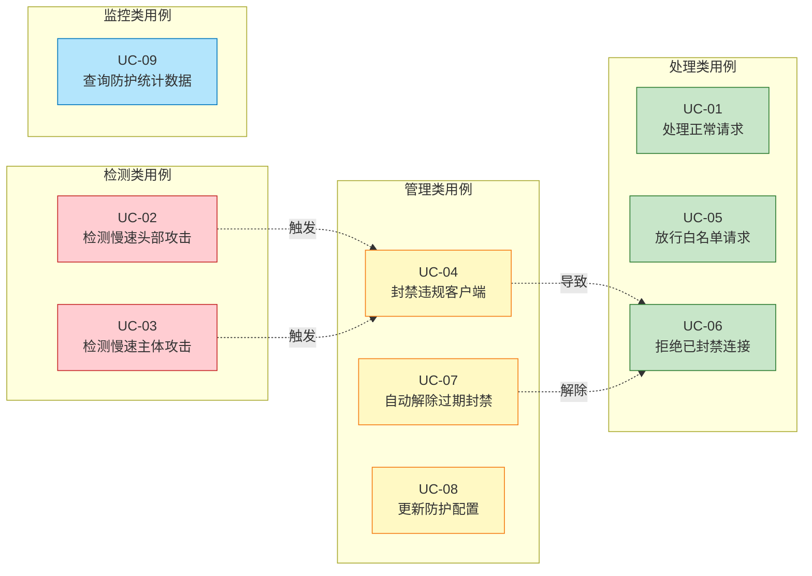
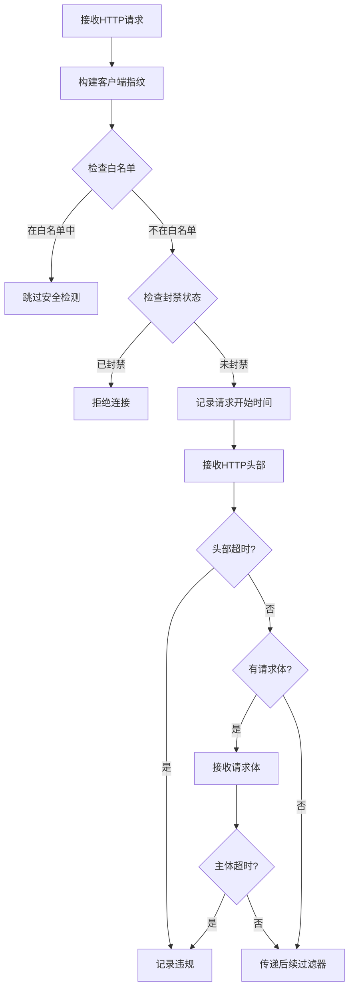
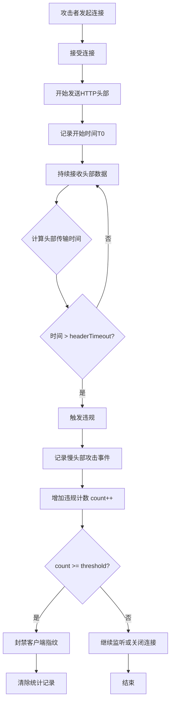
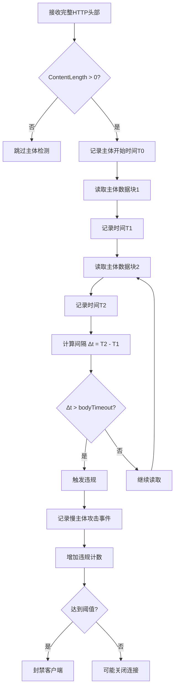
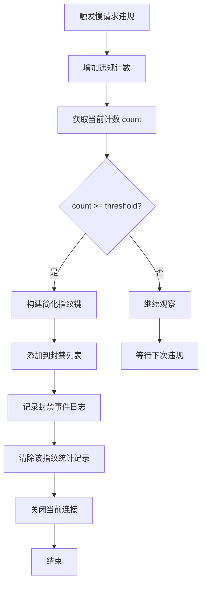
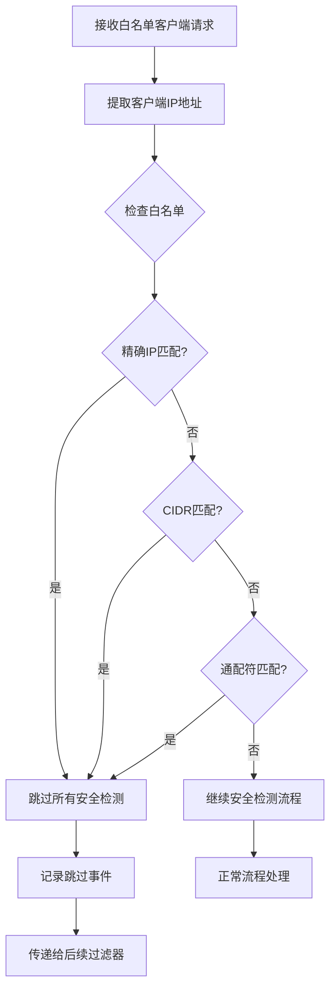
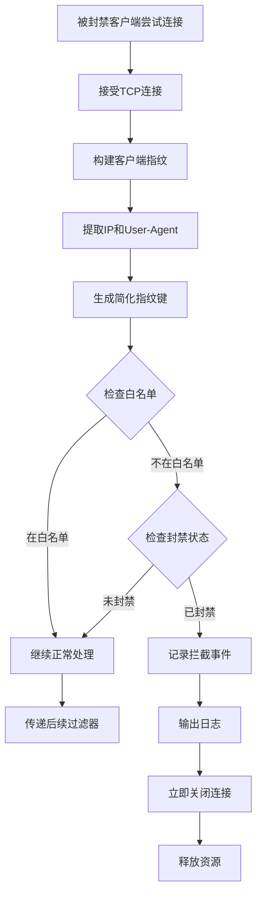
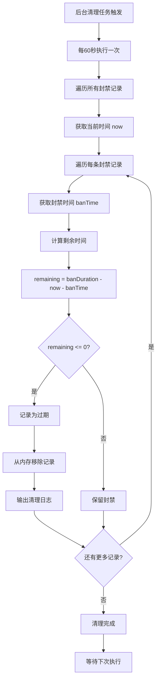
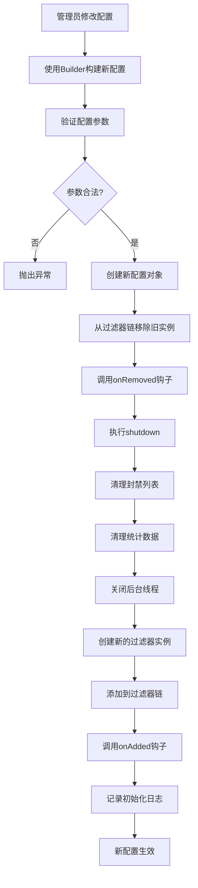
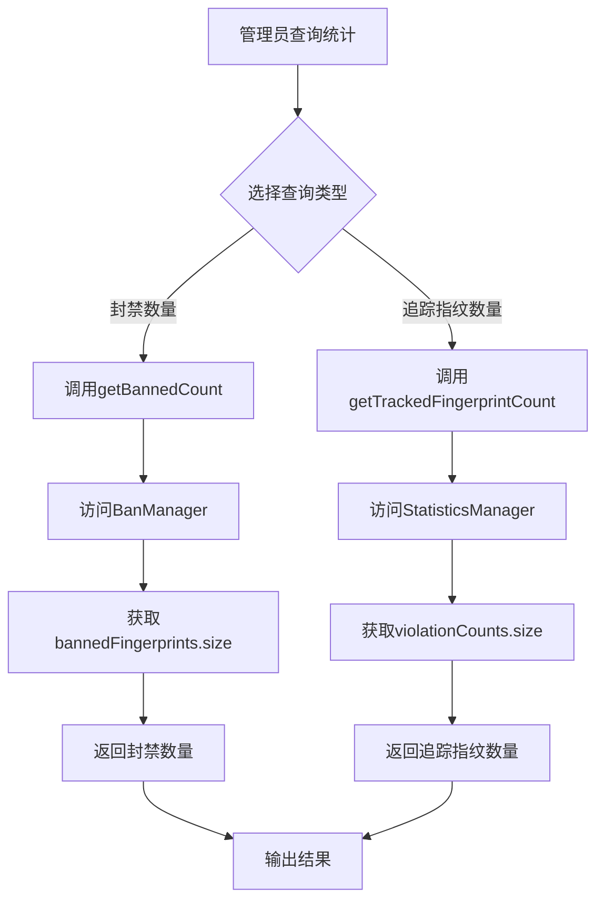

# 慢请求攻击防护功能 - UseCase 描述

| 文档版本 | 1.0 |
|---------|-----|
| 创建日期 | 2026-03-03 |
| 适用版本 | Grizzly 2.4.x |
| 关联需求 | slow-request-attack-protection-requirements.md |

---

## 1. 用例概述

### 1.1 系统边界

```
┌─────────────────────────────────────────────────────────────────┐
│                        Grizzly HTTP 服务器                       │
│  ┌───────────────────────────────────────────────────────────┐  │
│  │              SlowAttackProtectionFilter                   │  │
│  │  ┌───────────┐ ┌──────────────┐ ┌─────────────────────┐  │  │
│  │  │ 白名单管理 │ │ 指纹识别     │ │ 违规检测与处理      │  │  │
│  │  │           │ │              │ │                     │  │  │
│  │  │ Whitelist │ │ Fingerprint  │ │ BanManager          │  │  │
│  │  │ Manager   │ │ Builder      │ │ StatisticsManager   │  │  │
│  │  └───────────┘ └──────────────┘ └─────────────────────┘  │  │
│  └───────────────────────────────────────────────────────────┘  │
└─────────────────────────────────────────────────────────────────┘
         ▲                                    │
         │                                    │
    客户端请求                             日志输出
```

### 1.2 参与者

| 参与者 | 描述 | 权限 |
|-------|------|-----|
| **普通客户端** | 正常访问服务的用户 | 受防护规则约束 |
| **攻击者** | 尝试发动慢速攻击的恶意用户 | 被检测和封禁 |
| **白名单客户端** | 可信的客户端，绕过防护检查 | 不受防护限制 |
| **系统管理员** | 配置和监控防护功能 | 管理配置和查看统计 |

### 1.3 用例图

```mermaid
graph TB
    %% 参与者
    Client((普通客户端))
    Attacker((攻击者))
    WhitelistClient((白名单客户端))
    Admin((系统管理员))

    %% 系统边界
    subgraph Grizzly_HTTP_Server["Grizzly HTTP 服务器 - 慢请求攻击防护系统"]
        %% 主要用例
        UC01(处理正常请求)
        UC02(检测慢速头部攻击)
        UC03(检测慢速主体攻击)
        UC04(封禁违规客户端)
        UC05(放行白名单请求)
        UC06(拒绝已封禁连接)
        UC07(自动解除过期封禁)
        UC08(更新防护配置)
        UC09(查询防护统计数据)

        %% 用例关系
        UC02 -.-> UC04: 触发
        UC03 -.-> UC04: 触发
        UC04 -.-> UC06: 导致
        UC07 -.-> UC06: 解除
    end

    %% 参与者与用例的关系
    Client --> UC01
    Attacker --> UC02
    Attacker --> UC03
    Attacker --> UC04
    Attacker --> UC06
    WhitelistClient --> UC05
    Admin --> UC08
    Admin --> UC09

    %% 样式定义
    classDef actorStyle fill:#e1f5ff,stroke:#01579b,stroke-width:2px
    classDef usecaseStyle fill:#fff9c4,stroke:#f57f17,stroke-width:2px
    classDef systemStyle fill:#f3e5f5,stroke:#4a148c,stroke-width:2px,stroke-dashd: 5 5

    class Client,Attacker,WhitelistClient,Admin actorStyle
    class UC01,UC02,UC03,UC04,UC05,UC06,UC07,UC08,UC09 usecaseStyle
    class Grizzly_HTTP_Server systemStyle
```

### 1.4 用例包结构



---

## 2. 主要用例列表

| UC-ID | 用例名称 | 优先级 | 涉及参与者 |
|-------|---------|-------|-----------|
| UC-01 | 处理正常请求 | P0 | 普通客户端 |
| UC-02 | 检测慢速头部攻击 | P0 | 攻击者 |
| UC-03 | 检测慢速主体攻击 | P0 | 攻击者 |
| UC-04 | 封禁违规客户端 | P0 | 攻击者 |
| UC-05 | 放行白名单请求 | P1 | 白名单客户端 |
| UC-06 | 拒绝已封禁连接 | P0 | 攻击者 |
| UC-07 | 自动解除过期封禁 | P0 | 系统 |
| UC-08 | 更新防护配置 | P1 | 系统管理员 |
| UC-09 | 查询防护统计数据 | P2 | 系统管理员 |

---

## 3. 详细用例描述

### UC-01: 处理正常请求

**用例名称**: 处理正常请求

**参与者**: 普通客户端

**优先级**: P0 (必须)

**前置条件**:
1. SlowAttackProtectionFilter 已正确初始化并添加到过滤器链
2. 客户端 IP 不在白名单中
3. 客户端未被封禁

**后置条件**:
1. 请求正常传递给后续过滤器处理
2. 无违规记录产生
3. 无封禁操作执行

**主流程**:

| 步骤 | 操作 | 系统响应 |
|-----|------|---------|
| 1 | 客户端发起 HTTP 请求 | 接收请求 |
| 2 | 系统构建客户端指纹 | 生成 IP+UA+Pattern 指纹 |
| 3 | 检查白名单 | IP 不在白名单中，继续 |
| 4 | 检查封禁状态 | 指纹未被封禁，继续 |
| 5 | 记录请求开始时间 | 存储时间戳 |
| 6 | 接收 HTTP 头部 | 头部在超时时间内完成 |
| 7 | 接收请求体（如有） | 请求体在超时时间内完成 |
| 8 | 传递给后续过滤器 | 正常处理 |

**流程图**:



**替代流程**:

| 条件 | 操作 |
|-----|------|
| 请求体为空 | 跳过主体超时检测 |

**业务规则**:
- 所有时间检测使用配置的超时阈值
- 正常请求不应触发任何安全事件日志

---

### UC-02: 检测慢速头部攻击

**用例名称**: 检测慢速头部攻击

**参与者**: 攻击者

**优先级**: P0 (必须)

**前置条件**:
1. SlowAttackProtectionFilter 已启用
2. 攻击者 IP 不在白名单中
3. 攻击者未被封禁

**后置条件**:
1. 检测到慢头部攻击
2. 记录违规事件
3. 违规计数增加

**主流程**:

| 步骤 | 操作 | 系统响应 |
|-----|------|---------|
| 1 | 攻击者发起连接 | 接受连接 |
| 2 | 攻击者开始发送 HTTP 头部 | 记录开始时间 |
| 3 | 攻击者故意缓慢发送头部数据（如每 10ms 发送 1 字节） | 持续接收 |
| 4 | 系统检测到头部传输时间超过 headerTimeout | **触发违规** |
| 5 | 系统记录慢头部攻击事件 | 日志: `[SLOW-ATTACK] Slow header detected` |
| 6 | 系统增加该指纹的违规计数 | count = count + 1 |
| 7 | 系统检查是否达到封禁阈值 | 若未达到，继续监听 |
| 8 | 系统关闭连接或继续处理 | 根据配置决定 |

**时序图**:

```
攻击者              Grizzly过滤器           时间统计
  │                     │                    │
  ├─ 发送头部开始 ────────┼─ 记录开始时间 ────┤
  │                     │                    │
  ├─ 发送部分字节 ────────┼── 5ms 间隔 ───────┤
  │                     │                    │
  ├─ 发送部分字节 ────────┼── 累计 5000ms ───┤
  │                     │                    │
  │                     ◄─ 超时! ────────────┤
  │                     │                    │
  │                     ├─ 记录违规 ─────────┤
  │                     ├─ 增加计数 ─────────┤
  │                     │                    │
```

**流程图**:



**业务规则**:
- headerTimeout 默认为 5000ms
- 违规计数基于完整指纹（包含请求模式）
- 日志级别为 DETAILED 时记录详细事件

---

### UC-03: 检测慢速主体攻击

**用例名称**: 检测慢速主体攻击

**参与者**: 攻击者

**优先级**: P0 (必须)

**前置条件**:
1. SlowAttackProtectionFilter 已启用
2. 请求包含 Content-Length > 0
3. 攻击者 IP 不在白名单中

**后置条件**:
1. 检测到慢主体攻击
2. 记录违规事件
3. 违规计数增加

**主流程**:

| 步骤 | 操作 | 系统响应 |
|-----|------|---------|
| 1 | 攻击者发送完整的 HTTP 头部 | 头部正常接收 |
| 2 | 头部包含 Content-Length: 10000000 | 识别为大主体请求 |
| 3 | 系统记录主体开始接收时间 | 存储时间戳 |
| 4 | 攻击者缓慢发送主体数据（如每 100ms 发送 1 字节） | 持续接收 |
| 5 | 系统检测到两次读取间隔超过 bodyTimeout | **触发违规** |
| 6 | 系统记录慢主体攻击事件 | 日志: `[SLOW-ATTACK] Slow body detected` |
| 7 | 系统增加该指纹的违规计数 | count = count + 1 |
| 8 | 系统可能关闭连接 | 释放资源 |

**检测逻辑**:

```
┌─────────────────────────────────────────────────────────┐
│                    慢主体检测流程                         │
├─────────────────────────────────────────────────────────┤
│                                                         │
│  读取操作 1 ──[记录时间 t1]── 读取操作 2                │
│                  │                                      │
│                  └── Δt = t2 - t1                       │
│                                                         │
│              Δt > bodyTimeout?                          │
│                    │                                    │
│         ┌──────────┴──────────┐                         │
│         ▼                     ▼                         │
│        YES                   NO                         │
│         │                     │                         │
│    触发违规             继续正常处理                     │
│         │                     │                         │
└─────────────────────────────────────────────────────────┘
```

**流程图**:



**业务规则**:
- bodyTimeout 默认为 10000ms
- 仅对包含请求体的请求进行检测
- 检测的是两次连续读取操作之间的时间间隔

---

### UC-04: 封禁违规客户端

**用例名称**: 封禁违规客户端

**参与者**: 攻击者

**优先级**: P0 (必须)

**前置条件**:
1. 攻击者已多次触发慢请求检测
2. 违规次数接近阈值

**后置条件**:
1. 攻击者指纹被封禁
2. 后续连接被拒绝
3. 封禁记录被创建

**主流程**:

| 步骤 | 操作 | 系统响应 |
|-----|------|---------|
| 1 | 攻击者第 N 次触发慢请求违规 | 检测到违规 |
| 2 | 系统增加违规计数 | count = threshold |
| 3 | 系统检查是否达到封禁阈值 | **达到阈值** |
| 4 | 系统封禁该简化指纹 | 记录到 BanManager |
| 5 | 系统记录封禁事件 | 日志: `[SLOW-ATTACK] Fingerprint BANNED` |
| 6 | 系统清除该指纹的统计记录 | 重置计数 |
| 7 | 系统关闭当前连接 | 释放资源 |

**状态转换图**:

```
                              ┌──────────────┐
                              │   正常状态    │
                              │  count = 0   │
                              └───────┬──────┘
                                      │
                                第 1 次违规
                                      │
                                      ▼
                              ┌──────────────┐
                              │   观察状态    │◄─────────┐
                              │  1 ≤ c < T   │          │
                              └───────┬──────┘          │
                                      │                 │
                                第 2~T-1 次违规         │
                                      │                 │
                                      ▼                 │
                              ┌──────────────┐          │
                              │   警告状态    │          │ 封禁到期
                              │  c = T-1     │          │ 自动解封
                              └───────┬──────┘          │
                                      │                 │
                                第 T 次违规             │
                                      │                 │
                                      ▼                 │
                              ┌──────────────┐          │
                              │   封禁状态    │──────────┘
                              │ banDuration  │
                              └──────────────┘

                        T = slowRequestThreshold (默认 5)
```

**流程图**:



**业务规则**:
- slowRequestThreshold 默认为 5 次
- 封禁基于简化指纹（IP + User-Agent）
- banDuration 默认为 300000ms (5分钟)
- 封禁后该指纹的所有请求模式都会被拒绝

---

### UC-05: 放行白名单请求

**用例名称**: 放行白名单请求

**参与者**: 白名单客户端

**优先级**: P1 (重要)

**前置条件**:
1. 客户端 IP 在白名单中
2. 白名单配置已加载

**后置条件**:
1. 请求正常处理
2. 不进行任何安全检测
3. 不记录任何安全事件

**主流程**:

| 步骤 | 操作 | 系统响应 |
|-----|------|---------|
| 1 | 白名单客户端发起请求 | 接收请求 |
| 2 | 系统提取客户端 IP | 获取 IP 地址 |
| 3 | 系统检查白名单 | **IP 在白名单中** |
| 4 | 系统跳过所有安全检测 | 直接放行 |
| 5 | 系统记录跳过事件（DETAILED 级别） | 日志: `[SLOW-ATTACK] Request skipped - IP whitelisted` |
| 6 | 请求传递给后续过滤器 | 正常处理 |

**白名单匹配优先级**:

```
                  ┌─────────────────┐
                  │  白名单检查开始  │
                  └────────┬────────┘
                           │
            ┌──────────────┼──────────────┐
            │              │              │
            ▼              ▼              ▼
       ┌─────────┐   ┌─────────┐   ┌──────────┐
       │ 精确 IP │   │  CIDR   │   │ 通配符   │
       │ 匹配   │   │  匹配   │   │  匹配    │
       └────┬────┘   └────┬────┘   └────┬─────┘
            │             │             │
            └──────────────┼─────────────┘
                           │
                    任一匹配成功?
                           │
              ┌────────────┴────────────┐
              ▼                         ▼
             YES                        NO
              │                         │
         跳过安全检测             继续安全检测
              │                         │
```

**流程图**:



**业务规则**:
- 白名单检查优先于所有其他检查
- 支持三种匹配模式：精确 IP、CIDR、通配符
- 白名单跳过仅在 DETAILED 日志级别记录

---

### UC-06: 拒绝已封禁连接

**用例名称**: 拒绝已封禁连接

**参与者**: 攻击者

**优先级**: P0 (必须)

**前置条件**:
1. 客户端指纹已被封禁
2. 封禁尚未过期

**后置条件**:
1. 连接被立即关闭
2. 记录拦截事件
3. 不消耗服务器资源

**主流程**:

| 步骤 | 操作 | 系统响应 |
|-----|------|---------|
| 1 | 被封禁客户端尝试建立新连接 | 接受连接 |
| 2 | 系统构建客户端指纹 | 生成 IP+UA 指纹 |
| 3 | 系统检查白名单 | 不在白名单中 |
| 4 | 系统检查封禁状态 | **指纹已被封禁** |
| 5 | 系统记录拦截事件 | 日志: `[SLOW-ATTACK] Ban enforced` |
| 6 | 系统立即关闭连接 | 释放资源 |
| 7 | 请求不传递给后续过滤器 | **阻止** |

**拦截流程图**:

```
  ┌─────────┐
  │ 新连接   │
  └────┬────┘
       │
       ▼
  ┌─────────────────┐
  │  构建客户端指纹  │
  └────┬────────────┘
       │
       ▼
  ┌─────────────────┐      ┌──────────────┐
  │  检查白名单      │ ─否─→│ 继续处理     │
  └────┬────────────┘      └──────────────┘
       │ 是
       ▼
  ┌─────────────────┐      ┌──────────────┐
  │  检查封禁状态    │ ─否─→│ 继续处理     │
  └────┬────────────┘      └──────────────┘
       │ 已封禁
       ▼
  ┌─────────────────┐
  │  记录拦截事件    │
  └────┬────────────┘
       │
       ▼
  ┌─────────────────┐
  │  立即关闭连接    │
  └─────────────────┘
```

**流程图**:



**业务规则**:
- 封禁检查在白名单检查之后
- 封禁基于简化指纹（IP + User-Agent）
- 被封禁的请求不传递给任何后续过滤器
- 拦截事件在 BASIC 及以上日志级别记录

---

### UC-07: 自动解除过期封禁

**用例名称**: 自动解除过期封禁

**参与者**: 系统（后台定时任务）

**优先级**: P0 (必须)

**前置条件**:
1. 存在已过期的封禁记录
2. 后台清理任务正在运行

**后置条件**:
1. 过期封禁记录被移除
2. 内存资源被释放
3. 客户端可以重新建立连接

**主流程**:

| 步骤 | 操作 | 系统响应 |
|-----|------|---------|
| 1 | 后台清理任务触发（每 60 秒） | 启动清理流程 |
| 2 | 系统遍历所有封禁记录 | 获取封禁时间戳 |
| 3 | 系统计算每条记录的剩余时间 | remaining = banDuration - (now - banTime) |
| 4 | 系统识别过期记录 | remaining ≤ 0 |
| 5 | 系统移除过期记录 | 从内存删除 |
| 6 | 系统记录清理事件（FINE 级别） | 日志: `Ban expired - key: xxx` |
| 7 | 清理任务完成 | 等待下次执行 |

**时间线图**:

```
    ┌────────────┐                    ┌────────────┐
    │  封禁时刻   │                    │  清理任务   │
    │  T0        │                    │  每 60s     │
    └─────┬──────┘                    └─────┬──────┘
          │                                 │
          ▼                                 ▼
    ┌──────────────────────────────────────────────┐
    │              封禁有效期                        │
    │         banDuration = 300000ms               │
    └──────────────────────────────────────────────┘
          │                                     │
          │                                     │
          └─────────────────────────────────────┘
                         │
                    自动过期解除
```

**流程图**:



**业务规则**:
- 清理间隔默认为 60000ms (1分钟)
- 过期判断基于封禁时长和当前时间
- 清理操作在后台线程执行，不影响主流程
- 过期后客户端需要重新建立连接（指纹会被重新评估）

---

### UC-08: 更新防护配置

**用例名称**: 更新防护配置

**参与者**: 系统管理员

**优先级**: P1 (重要)

**前置条件**:
1. SlowAttackProtectionFilter 正在运行
2. 管理员有权限修改配置

**后置条件**:
1. 新配置生效
2. 旧配置被替换
3. 不影响正在处理的请求

**主流程**:

| 步骤 | 操作 | 系统响应 |
|-----|------|---------|
| 1 | 管理员构建新的配置对象 | 使用 Builder 模式 |
| 2 | 管理员调用过滤器移除方法 | 从过滤器链移除 |
| 3 | 系统调用 shutdown() 方法 | 清理资源 |
| 4 | 系统等待当前请求处理完成 | 优雅关闭 |
| 5 | 管理员添加新的过滤器实例 | 新配置生效 |
| 6 | 系统记录配置变更 | 日志: `SlowAttackProtectionFilter initialized` |

**配置变更流程**:

```
  ┌──────────────┐
  │  原过滤器实例  │
  │  Config v1   │
  └──────┬───────┘
         │
         │ onRemoved()
         ▼
  ┌──────────────┐
  │   shutdown   │
  │ - 清理封禁    │
  │ - 清理统计    │
  │ - 关闭线程    │
  └──────┬───────┘
         │
         ▼
  ┌──────────────┐
  │  新过滤器实例  │
  │  Config v2   │
  └──────┬───────┘
         │
         │ onAdded()
         ▼
  ┌──────────────┐
  │   初始化     │
  │ - 加载配置    │
  │ - 启动任务    │
  └──────────────┘
```

**流程图**:



**业务规则**:
- 配置对象不可变
- 配置变更需要替换过滤器实例
- 支持热更新，无需重启服务器
- shutdown() 方法阻塞等待资源清理完成

---

### UC-09: 查询防护统计数据

**用例名称**: 查询防护统计数据

**参与者**: 系统管理员

**优先级**: P2 (一般)

**前置条件**:
1. SlowAttackProtectionFilter 正在运行
2. 管理员需要获取运行状态

**后置条件**:
1. 返回当前统计信息
2. 不影响过滤器运行

**主流程**:

| 步骤 | 操作 | 系统响应 |
|-----|------|---------|
| 1 | 管理员调用 getBannedCount() | 返回当前被封禁的指纹数量 |
| 2 | 管理员调用 getTrackedFingerprintCount() | 返回正在追踪的指纹数量 |
| 3 | 系统返回统计信息 | 实时数据 |

**可用的监控指标**:

| 指标 | 方法 | 说明 |
|-----|------|-----|
| 封禁数量 | `getBannedCount()` | 当前被封禁的简化指纹数量 |
| 追踪指纹数量 | `getTrackedFingerprintCount()` | 正在统计的完整指纹数量 |

**流程图**:



**业务规则**:
- 统计数据实时获取
- 不提供历史数据查询
- 不包括已清理的过期数据

---

## 4. 异常用例

### UC-E01: 指纹构建失败

**描述**: 当无法从请求中提取必要信息时

**处理流程**:
1. 捕获构建指纹时的异常
2. 回退到仅使用 IP 地址的简化指纹
3. 记录警告日志
4. 继续处理请求

### UC-E02: 配置参数非法

**描述**: 当管理员提供非法配置参数时

**处理流程**:
1. Builder.build() 检测到非法参数
2. 抛出 IllegalArgumentException
3. 包含详细的错误信息
4. 过滤器不会被创建

### UC-E03: 内存不足

**描述**: 当系统内存不足，无法分配新的统计数据时

**处理流程**:
1. ConcurrentHashMap 操作失败
2. 记录严重错误日志
3. 跳过当前请求的统计
4. 不影响请求的正常处理

---

## 5. 用例关系图

```
                        ┌─────────────┐
                        │   UC-01     │
                        │ 处理正常请求 │
                        └──────┬──────┘
                               │
                  ┌────────────┼────────────┐
                  │            │            │
                  ▼            ▼            ▼
           ┌────────────┐ ┌─────────┐ ┌────────────┐
           │  UC-05     │ │ UC-02/3 │ │  UC-04     │
           │放行白名单  │ │攻击检测 │ │封禁违规    │
           │  请求      │ │         │ │  客户端    │
           └────────────┘ └────┬────┘ └──────┬─────┘
                               │             │
                               ▼             ▼
                        ┌────────────┐ ┌────────────┐
                        │  UC-06     │ │  UC-07     │
                        │拒绝已封禁  │ │自动解除    │
                        │  连接      │ │过期封禁    │
                        └────────────┘ └────────────┘

          ┌────────────┐                ┌────────────┐
          │  UC-08     │                │  UC-09     │
          │更新防护    │                │查询防护    │
          │  配置      │                │统计数据    │
          └────────────┘                └────────────┘
```

---

## 6. 数据流示例

### 示例 1: 攻击者被检测并封禁的完整流程

```
时刻    事件                                    客户端状态
──────────────────────────────────────────────────────────────
T0      攻击者发起连接                              正常
T1      发送头部开始                               正常
T2      头部发送超时 (6000ms > 5000ms)             违规 #1
T3      连接关闭，攻击者重试                       正常
T4      主体发送超时 (11000ms > 10000ms)           违规 #2
...     (类似违规继续)                            ...
Tn      第 5 次违规达到阈值                        违规 #5
Tn+1    指纹被封禁                                **已封禁**
Tn+2    攻击者尝试新连接                          **连接被拒**
Tn+3    攻击者再次尝试                            **连接被拒**
...     (持续 5 分钟)                             **持续被拒**
Tm      封禁过期                                  正常 (重新评估)
```

### 示例 2: 白名单客户端始终放行

```
时刻    事件                                    处理结果
──────────────────────────────────────────────────────────────
T0      白名单客户端请求 (IP: 10.0.0.5)           白名单匹配
T1      跳过所有安全检测                          直接放行
T2      请求正常处理                              完成
```

---

## 7. 性能用例

### UC-P01: 高并发正常请求

**描述**: 系统处理大量正常并发请求

**指标**:
- 并发连接数: 10,000+
- 请求速率: 50,000 req/s
- 性能影响: < 5%

### UC-P02: 大规模攻击场景

**描述**: 系统同时处理大量攻击连接

**指标**:
- 攻击连接数: 1,000+
- 检测延迟: < 100ms
- 内存占用: < 100MB
- CPU 开销: < 10%

---

## 8. 安全用例

### UC-S01: 指纹伪造尝试

**描述**: 攻击者尝试通过修改 User-Agent 伪造指纹

**处理**:
- 系统 IP 地址优先级最高
- 修改 User-Agent 会生成新的指纹
- 原指纹的封禁状态仍然有效

### UC-S02: IP 地址轮换

**描述**: 攻击者尝试通过更换 IP 绕过封禁

**处理**:
- 每个新 IP 需要重新累积违规
- 白名单可以配置 IP 范围
- 可扩展支持 IP 信誉数据库集成

---

## 9. 合规性用例

### UC-C01: 日志审计

**描述**: 满足安全审计的日志记录要求

**要求**:
- 所有安全事件可追溯
- 日志包含时间戳、IP、事件类型
- 日志保留时间符合政策

### UC-C02: 数据保护

**描述**: 客户端数据的隐私保护

**要求**:
- 不记录敏感请求内容
- 指纹数据不可逆
- 过期数据自动清理

---

## 10. 变更历史

| 版本 | 日期 | 变更内容 | 作者 |
|-----|------|---------|------|
| 1.0 | 2026-03-03 | 初始版本 | System |
| 1.1 | 2026-03-03 | 用例名称规范化：添加动词开头，简化过长名称，拆分复合用例 | System |
| 1.2 | 2026-03-03 | 添加主流程流程图：使用 Mermaid 图表增强流程可视化 | System |
| 1.3 | 2026-03-03 | 添加 UML 用例图：使用 Mermaid 展示参与者与用例关系 | System |
